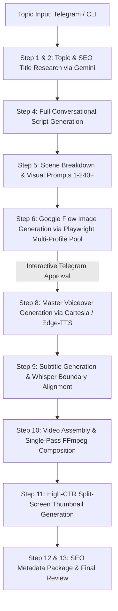

# Complete Setup Guide: YouTube Automation Workflow Pipeline (From Scratch)

> **For the User & Antigravity Agent:**  
> This document is an all-inclusive, end-to-end blueprint to set up and run the automated YouTube Video Creation Pipeline on a fresh computer.  
> If you are an **Antigravity AI Agent** assisting a user, you can follow this guide section-by-section to inspect system prerequisites, install dependencies, scaffold the directory tree, create core scripts, configure accounts, and launch the pipeline autonomously.

---

## Table of Contents
1. [Pipeline Architecture & Workflow](#1-pipeline-architecture--workflow)
2. [System Prerequisites & External Tools](#2-system-prerequisites--external-tools)
3. [Repository & Directory Scaffolding](#3-directory-scaffolding)
4. [Python Environment & Package Installation](#4-python-environment--package-installation)
5. [Environment Variables (.env) Configuration](#5-environment-variables-env-configuration)
6. [Google Flow (Image Gen) Multi-Account Authentication](#6-google-flow-image-gen-multi-account-authentication)
7. [Telegram Bot (Human-in-the-Loop) Setup](#7-telegram-bot-human-in-the-loop-setup)
8. [Core Code Blueprints](#8-core-code-blueprints)
   - [8.1 `playwright_flow_generator.py` (Google Flow Engine)](#81-playwright_flow_generatorpy)
   - [8.2 `creative_assistant.py` (Script, Prompts & Gemini Key Rotation)](#82-creative_assistantpy)
   - [8.3 `voiceover.py` (Master Voiceover Engine - Edge-TTS & Cartesia)](#83-voiceoverpy)
   - [8.4 `assemble_video.py` (FFmpeg Zero-Drift Video Composer)](#84-assemble_videopy)
   - [8.5 `telegram_bot.py` (Interactive Mobile Control Bot)](#85-telegram_botpy)
   - [8.6 `thumbnail_generator.py` (High-CTR Split-Screen Thumbnail)](#86-thumbnail_generatorpy)
   - [8.7 `youtube_agent.py` (Master Orchestrator & State Machine)](#87-youtube_agentpy)
9. [Assets & Fonts Setup](#9-assets--fonts-setup)
10. [Step-by-Step Pipeline Execution](#10-step-by-step-pipeline-execution)
11. [Troubleshooting & Self-Healing Matrix](#11-troubleshooting--self-healing-matrix)

---

## 1. Pipeline Architecture & Workflow

The pipeline is an autonomous, self-healing, human-in-the-loop production engine that turns a topic into a fully produced 16:9 YouTube video.



### Core Golden Rules (Never Break These)
1. **Duration Hard-Lock (Rule 1):** The final video duration MUST equal the master voiceover audio duration ($\pm 0.050\text{s}$). No audio or visuals may ever drift or cut off abruptly.
2. **Contiguous Audio Slicing (Rule 2 & 7):** The voiceover is generated as **one continuous master audio track**. Scenes are boundary-sliced ($[0, T_1], [T_1, T_2], \dots, [T_{N-1}, T_{\text{total}}]$) with **zero audio tampering**, trimming, or silence stripping.
3. **Multi-Account Rotation (Rule 4):** Google Flow image generation rotates through multiple local Chrome user profiles (`acc1`, `acc2`, `acc3`, `acc4`) with automatic process-lock clearing.
4. **Art Style DNA (Zenn & Mack Aesthetic - Rule 8 & 9):** 2D minimalist doodle webcomic style, bold black marker outlines, solid vibrant cel-shaded fills, light blue sky (`#87CEEB`), natural earth ground, recurring mascot (e.g. Rich Sany with `#F9D342` round head, tailored business suit with red tie). Strictly **zero AI text** inside scene illustrations.
5. **Rule 5 Anti-Jargon:** Never put TTS-hostile acronyms or technical jargon in the spoken narration (e.g. say *"molecular scissors"* instead of *"CRISPR-Cas9"*).

---

## 2. System Prerequisites & External Tools

Before installing Python packages, ensure the host system has:

### A. Operating System
- Recommended: Windows 10/11 64-bit (or Ubuntu 22.04 LTS / macOS).

### B. Python 3.10, 3.11, or 3.12
- Verify:
  ```powershell
  python --version
  ```
- Ensure Python and pip are in the system `PATH`.

### C. Google Chrome
- Google Chrome installed in standard directory:
  - Windows: `C:\Program Files\Google\Chrome\Application\chrome.exe`

### D. FFmpeg
- FFmpeg and FFprobe are **mandatory** for video rendering, audio slicing, and alignment.
- Windows Installation:
  ```powershell
  winget install Gyan.FFmpeg
  ```
- Verify:
  ```powershell
  ffmpeg -version
  ffprobe -version
  ```

### E. Node.js (v18+ or v20+)
- Verify:
  ```powershell
  node -v
  npm -v
  ```

---

## 3. Directory Scaffolding

Run this in PowerShell to create the standard folder hierarchy:

```powershell
mkdir youtube_automation_agent
cd youtube_automation_agent
mkdir .gflow\profiles\acc1
mkdir .gflow\profiles\acc2
mkdir .gflow\profiles\acc3
mkdir channels\science
mkdir channels\history
mkdir channels\money
mkdir assets\fonts
mkdir assets\music
mkdir assets\sfx
mkdir temp
```

### Standard Project Structure Created per Video Project:
When a new topic starts, the pipeline creates 15 dedicated directories:
- `01_Research/`: Outlines, reference materials, fact sheets.
- `02_SEO/`: CTR titles, viral tags, hashtags, and YouTube descriptions.
- `03_Script/`: Approved script drafts and full voiceover text.
- `04_Scenes/`: Scene breakdown table with visual beats.
- `05_Image_Prompts/`: Individual prompt files (`Scene_01_Prompt.txt`, `Scene_02_Prompt.txt`, etc.).
- `06_Images/`: Raw generated images and `Approved/` subfolder.
- `07_Voice/`: Master voiceover audio (`Full_Script_Voice_pcm.wav`) and sliced per-scene audio clips.
- `08_Background_Music/`: Background music tracks and volume mixes.
- `09_Subtitles/`: Word-level timestamps, alignment JSONs, and SRT subtitles.
- `10_Animation/`: Rendered per-scene MP4 video clips.
- `11_Final_Video/`: Master assembled video (`Video_Final.mp4`) with burnt-in subtitles.
- `12_Thumbnail/`: Split-screen thumbnail PNGs.
- `13_Logs/`: Detailed pipeline logs and execution traces.
- `14_Checkpoints/`: State recovery JSON files.
- `15_Backups/`: Archival packages.

---

## 4. Python Environment & Package Installation

Create a virtual environment:

```powershell
python -m venv venv
.\venv\Scripts\Activate.ps1
python -m pip install --upgrade pip
```

### Create `requirements.txt`:
```text
playwright>=1.40.0
google-genai>=0.1.1
google-api-python-client>=2.100.0
google-auth-oauthlib>=1.1.0
requests>=2.31.0
httpx>=0.25.0
pillow>=10.0.0
python-dotenv>=1.0.0
psutil>=5.9.0
numpy>=1.24.0
opencv-python>=4.8.0
moviepy>=1.0.3
edge-tts>=6.1.9
faster-whisper>=1.0.0
click>=8.1.0
rich>=13.0.0
```

Install packages and Playwright Chromium:
```powershell
pip install -r requirements.txt
playwright install chromium
```

---

## 5. Environment Variables (`.env`) Configuration

Create `.env` in `youtube_automation_agent/.env`:

```ini
# ==========================================
# GEMINI API (Scripting, SEO & Scene Breakdown)
# Provide one or multiple keys for automatic rotation across quotas
# ==========================================
GEMINI_API_KEY=AIzaSyYourGeminiApiKeyHere1
GEMINI_API_KEY_2=AIzaSyYourGeminiApiKeyHere2

# ==========================================
# TELEGRAM BOT (Mobile Approval & Control)
# Create a bot via @BotFather on Telegram.
# Get your Chat ID by texting @userinfobot on Telegram.
# ==========================================
TELEGRAM_BOT_TOKEN=1234567890:ABCdefGHIjklMNOpqrSTUvwxyz
TELEGRAM_CHAT_ID=987654321

# ==========================================
# VOICE SYNTHESIS (TTS)
# Options: 'edge_tts' (100% Free) or 'cartesia'
# ==========================================
TTS_PROVIDER=edge_tts
CARTESIA_API_KEY=your_cartesia_api_key_if_used
CARTESIA_VOICE_ID=your_cartesia_voice_id_if_used

# ==========================================
# OPTIONAL FALLBACKS
# ==========================================
HF_TOKEN=your_huggingface_token_optional
```

---

## 6. Google Flow Multi-Account Authentication

Google Flow (`https://flow.google.com`) is the image generator used for 2D cartoon doodle scenes using **Nano Banana Pro**.

To prevent rate limits, the pipeline rotates across local persistent Chrome profiles (`acc1`, `acc2`, `acc3`).

### One-Time Interactive Login Helper (`login_accounts.py`):
```python
# login_accounts.py
import asyncio
import os
from playwright.async_api import async_playwright

PROFILES = [
    ("Account 1 (acc1)", r".gflow\profiles\acc1"),
    ("Account 2 (acc2)", r".gflow\profiles\acc2"),
    ("Account 3 (acc3)", r".gflow\profiles\acc3"),
]

async def login_profile(name, path):
    abs_path = os.path.abspath(path)
    os.makedirs(abs_path, exist_ok=True)
    print(f"\n==========================================")
    print(f"Opening browser for {name}...")
    print(f"1. Log into your Google Account.")
    print(f"2. Navigate to https://flow.google.com")
    print(f"3. Accept any prompt / Terms of Service.")
    print(f"4. Close the browser window when finished.")
    print(f"==========================================\n")
    
    async with async_playwright() as p:
        context = await p.chromium.launch_persistent_context(
            user_data_dir=abs_path,
            headless=False,
            channel="chrome",
            args=["--disable-blink-features=AutomationControlled"]
        )
        page = context.pages[0] if context.pages else await context.new_page()
        await page.goto("https://flow.google.com")
        
        while context.pages:
            await asyncio.sleep(1)

if __name__ == "__main__":
    for name, ppath in PROFILES:
        asyncio.run(login_profile(name, ppath))
```

Run once:
```powershell
python login_accounts.py
```

---

## 7. Telegram Bot Setup

1. Open Telegram and message `@BotFather`.
2. Send `/newbot`, name it (e.g. `My Production Bot`), and copy the API token to `TELEGRAM_BOT_TOKEN`.
3. Message `@userinfobot` to get your numerical Chat ID, and copy to `TELEGRAM_CHAT_ID`.
4. Send `/start` to your bot.

---

## 8. Core Code Blueprints

### 8.1 `playwright_flow_generator.py`
```python
# playwright_flow_generator.py
import asyncio
import os
import sys
import time
import subprocess
from playwright.async_api import async_playwright

PROFILES = [
    os.path.abspath(r".gflow\profiles\acc1"),
    os.path.abspath(r".gflow\profiles\acc2"),
    os.path.abspath(r".gflow\profiles\acc3"),
]

_LAST_PROFILE_IDX = 0

def _kill_profile_processes(prof_dir: str):
    """Terminates orphan background Chrome processes holding locks on this profile."""
    try:
        prof_name = os.path.basename(prof_dir)
        subprocess.run([
            "powershell", "-NoProfile", "-Command",
            f"Get-CimInstance Win32_Process -Filter \"Name='chrome.exe'\" | "
            f"Where-Object {{$_.CommandLine -like '*{prof_name}*'}} | "
            f"ForEach-Object {{Stop-Process -Id $_.ProcessId -Force -ErrorAction SilentlyContinue}}"
        ], capture_output=True, timeout=5)
    except Exception:
        pass

def _clean_profile_locks(prof_dir: str):
    """Removes stale Chromium Singleton locks to avoid ProcessSingleton collisions."""
    _kill_profile_processes(prof_dir)
    for lf in ["SingletonLock", "SingletonCookie", "SingletonSocket", "DevToolsActivePort", "lockfile", "LOCK"]:
        lp = os.path.join(prof_dir, lf)
        if os.path.exists(lp):
            try:
                os.remove(lp)
            except Exception:
                pass

async def _dismiss_modals(page):
    """Dismisses Google Flow's update dialogs, changelog popups, and cookie notices."""
    try:
        modal_btns = page.locator('button:has-text("Get started"), button:has-text("Dismiss"), button:has-text("Got it"), [aria-label="Close"], [aria-label="Dismiss"]')
        for _ in range(3):
            if await modal_btns.count() and await modal_btns.first.is_visible():
                await modal_btns.first.click()
                await asyncio.sleep(1)
            else:
                break
    except Exception:
        pass

async def _ensure_image_mode(page):
    """Ensures Google Flow is set to Image Mode (Nano Banana Pro) with 16:9 aspect ratio."""
    try:
        settings_btn = page.locator('button[aria-label="Settings trigger"]').first
        if await settings_btn.count():
            btn_text = await settings_btn.inner_text()
            if "Video" in btn_text:
                await settings_btn.click()
                await asyncio.sleep(1)
                img_tab = page.locator('button[role="tab"]:has-text("Image"), [role="menuitem"]:has-text("Image")').first
                if await img_tab.count():
                    await img_tab.click()
                    await asyncio.sleep(1)
                await page.keyboard.press("Escape")
    except Exception:
        pass

async def _generate_async(prompt: str, output_path: str, aspect_ratio: str = "16:9") -> bool:
    global _LAST_PROFILE_IDX
    abs_path = os.path.abspath(output_path)
    os.makedirs(os.path.dirname(abs_path), exist_ok=True)

    profiles_to_try = PROFILES[_LAST_PROFILE_IDX:] + PROFILES[:_LAST_PROFILE_IDX]

    for prof in profiles_to_try:
        if not os.path.exists(prof):
            continue
        prof_name = os.path.basename(prof)
        print(f"[Playwright Flow] Using profile: {prof_name}...", flush=True)

        _clean_profile_locks(prof)
        await asyncio.sleep(0.5)

        context = None
        try:
            async with async_playwright() as p:
                context = await p.chromium.launch_persistent_context(
                    user_data_dir=prof,
                    headless=True,
                    channel="chrome",
                    user_agent="Mozilla/5.0 (Windows NT 10.0; Win64; x64) AppleWebKit/537.36 (KHTML, like Gecko) Chrome/124.0.0.0 Safari/537.36",
                    args=["--disable-blink-features=AutomationControlled", "--no-sandbox"]
                )
                page = context.pages[0] if context.pages else await context.new_page()
                page.set_default_timeout(30000)

                await page.goto("https://labs.google/fx/tools/flow", timeout=30000)
                await asyncio.sleep(3)
                await _dismiss_modals(page)

                editor = page.locator('div.ProseMirror[contenteditable="true"], [role="textbox"]').first
                if not await editor.count():
                    proj_link = page.locator("a[href*='/project/']").first
                    if await proj_link.count():
                        await proj_link.click()
                        await asyncio.sleep(4)
                    else:
                        new_btn = page.locator('button:has-text("New project"), [aria-label*="New project"]').first
                        if await new_btn.count():
                            await new_btn.click()
                            await asyncio.sleep(4)

                await _dismiss_modals(page)
                await _ensure_image_mode(page)
                await asyncio.sleep(1)

                before_urls = set(await page.eval_on_selector_all(
                    "img", "(imgs) => imgs.map(i => i.currentSrc || i.src).filter(s => s && (s.includes('getMediaUrlRedirect') || s.includes('/asb/')))"
                ))

                editor = page.locator('div.ProseMirror[contenteditable="true"], [role="textbox"]').first
                await editor.wait_for(state="visible", timeout=25000)
                await editor.click()
                await page.keyboard.press("ControlOrMeta+a")
                await page.keyboard.press("Backspace")
                await page.keyboard.insert_text(prompt)
                await asyncio.sleep(1)

                arrow_btn = page.locator('button[aria-label="Start generation"], button.generate-icon-button, button:has(span:has-text("arrow_forward"))').first
                try:
                    await arrow_btn.wait_for(state="visible", timeout=10000)
                    for _ in range(10):
                        if await arrow_btn.is_enabled():
                            break
                        await asyncio.sleep(0.5)
                    await arrow_btn.click()
                except Exception:
                    await page.keyboard.press("ControlOrMeta+Enter")

                print(f"[Playwright Flow] Submitted prompt on {prof_name}. Polling for image...", flush=True)

                t0 = time.time()
                for attempt in range(50):
                    await asyncio.sleep(2)
                    elapsed = time.time() - t0

                    curr_urls = set(await page.eval_on_selector_all(
                        "img", "(imgs) => imgs.map(i => i.currentSrc || i.src).filter(s => s && (s.includes('getMediaUrlRedirect') || s.includes('/asb/')))"
                    ))
                    new_urls = curr_urls - before_urls

                    for new_url in new_urls:
                        bytes_arr = await page.evaluate("""async (url) => {
                            const res = await fetch(url);
                            if (!res.ok) return null;
                            const buf = await res.arrayBuffer();
                            return Array.from(new Uint8Array(buf));
                        }""", new_url)

                        if bytes_arr and len(bytes_arr) > 20000:
                            raw_bytes = bytearray(bytes_arr)
                            with open(abs_path, "wb") as f:
                                f.write(raw_bytes)
                            print(f"[Playwright Flow] SUCCESS! Saved ({len(raw_bytes)/1024:.1f} KB) in {elapsed:.1f}s -> {abs_path}", flush=True)
                            _LAST_PROFILE_IDX = PROFILES.index(prof)
                            await context.close()
                            _clean_profile_locks(prof)
                            return True

                    if elapsed > 45:
                        failed = await page.locator('text="unusual activity"').count()
                        if failed and not new_urls:
                            print(f"[Playwright Flow] Rate limited on {prof_name}. Rotating...", flush=True)
                            break

                await context.close()
                _clean_profile_locks(prof)
        except Exception as e:
            print(f"[Playwright Flow] Error on {prof_name}: {e}", flush=True)
            if context:
                try:
                    await context.close()
                except Exception:
                    pass
            _clean_profile_locks(prof)

    return False

def generate_image_playwright(prompt: str, output_path: str, aspect_ratio: str = "16:9") -> bool:
    try:
        return asyncio.run(_generate_async(prompt, output_path, aspect_ratio))
    except Exception as e:
        print(f"[Playwright Flow Exception]: {e}", flush=True)
        return False
```

---

### 8.2 `creative_assistant.py`
```python
# creative_assistant.py
import os
import json
from google import genai
from dotenv import load_dotenv

load_dotenv()

def get_gemini_keys():
    keys = []
    for k, v in os.environ.items():
        if k.startswith("GEMINI_API_KEY") and v.strip():
            keys.append(v.strip())
    return keys if keys else [os.environ.get("GEMINI_API_KEY", "")]

def call_gemini(prompt: str, model: str = "gemini-2.5-flash") -> str:
    keys = get_gemini_keys()
    for idx, key in enumerate(keys):
        try:
            client = genai.Client(api_key=key)
            response = client.models.generate_content(
                model=model,
                contents=prompt
            )
            if response and response.text:
                return response.text.strip()
        except Exception as e:
            print(f"[Gemini Key Rotation] Key #{idx+1} failed: {e}. Trying next key...")
    raise RuntimeError("All Gemini API keys exhausted or rate-limited.")
```

---

### 8.3 `voiceover.py`
```python
# voiceover.py
import os
import asyncio
import subprocess
import edge_tts
from dotenv import load_dotenv

load_dotenv()

TTS_PROVIDER = os.environ.get("TTS_PROVIDER", "edge_tts")

async def _generate_edge_tts(text: str, output_wav: str, voice: str = "en-US-ChristopherNeural"):
    temp_mp3 = output_wav.replace(".wav", "_temp.mp3")
    communicate = edge_tts.Communicate(text, voice)
    await communicate.save(temp_mp3)
    
    cmd = [
        "ffmpeg", "-y", "-i", temp_mp3,
        "-acodec", "pcm_s16le", "-ar", "44100", "-ac", "2",
        output_wav
    ]
    subprocess.run(cmd, stdout=subprocess.DEVNULL, stderr=subprocess.DEVNULL, check=True)
    if os.path.exists(temp_mp3):
        os.remove(temp_mp3)

def generate_master_voiceover(full_script_text: str, output_wav_path: str):
    os.makedirs(os.path.dirname(os.path.abspath(output_wav_path)), exist_ok=True)
    print(f"[Voiceover] Generating master voiceover via {TTS_PROVIDER}...")
    asyncio.run(_generate_edge_tts(full_script_text, output_wav_path))
    print(f"[Voiceover] Master voiceover saved: {output_wav_path}")
```

---

### 8.4 `assemble_video.py`
```python
# assemble_video.py
import os
import subprocess

def get_audio_duration(audio_path: str) -> float:
    cmd = [
        "ffprobe", "-v", "error",
        "-show_entries", "format=duration",
        "-of", "default=noprint_wrappers=1:nokey=1",
        audio_path
    ]
    res = subprocess.run(cmd, capture_output=True, text=True, check=True)
    return float(res.stdout.strip())

def assemble_single_pass_video(images_dir: str, master_audio_path: str, output_video_path: str, scene_durations: list):
    temp_list_file = os.path.join(images_dir, "concat_list.txt")
    with open(temp_list_file, "w", encoding="utf-8") as f:
        for idx, dur in enumerate(scene_durations):
            img_file = os.path.join(images_dir, f"{idx+1:03d}_Scene_{idx+1:02d}.png")
            if not os.path.exists(img_file):
                img_file = os.path.join(images_dir, f"{idx+1:03d}_Scene_{idx+1}.png")
            f.write(f"file '{img_file.replace(chr(92), '/')}'\n")
            f.write(f"duration {dur:.3f}\n")
        f.write(f"file '{img_file.replace(chr(92), '/')}'\n")

    cmd = [
        "ffmpeg", "-y",
        "-f", "concat", "-safe", "0", "-i", temp_list_file,
        "-i", master_audio_path,
        "-c:v", "libx264", "-pix_fmt", "yuv420p", "-r", "30",
        "-c:a", "aac", "-b:a", "192k",
        "-shortest",
        output_video_path
    ]
    print("[Assembler] Rendering master video with FFmpeg...")
    subprocess.run(cmd, check=True)
    print(f"[Assembler] Video generated successfully: {output_video_path}")
```

---

### 8.5 `telegram_bot.py`
```python
# telegram_bot.py
import os
import requests
import json
import time
from dotenv import load_dotenv

load_dotenv()

TOKEN = os.environ.get("TELEGRAM_BOT_TOKEN")
CHAT_ID = os.environ.get("TELEGRAM_CHAT_ID")
API_URL = f"https://api.telegram.org/bot{TOKEN}"

def send_message(text: str, reply_markup=None):
    if not TOKEN or not CHAT_ID:
        print(f"[Telegram Console]: {text}")
        return {}
    payload = {"chat_id": CHAT_ID, "text": text, "parse_mode": "Markdown"}
    if reply_markup:
        payload["reply_markup"] = json.dumps({"inline_keyboard": reply_markup})
    res = requests.post(f"{API_URL}/sendMessage", json=payload, timeout=10)
    return res.json()

def send_photo(photo_path: str, caption: str = ""):
    if not TOKEN or not CHAT_ID:
        print(f"[Telegram Console Photo]: {photo_path} - {caption}")
        return
    with open(photo_path, "rb") as f:
        requests.post(
            f"{API_URL}/sendPhoto",
            data={"chat_id": CHAT_ID, "caption": caption, "parse_mode": "Markdown"},
            files={"photo": f},
            timeout=30
        )

def wait_for_interaction(timeout_sec=3600):
    offset = None
    t0 = time.time()
    while time.time() - t0 < timeout_sec:
        url = f"{API_URL}/getUpdates?timeout=10"
        if offset:
            url += f"&offset={offset}"
        try:
            r = requests.get(url, timeout=15).json()
            for item in r.get("result", []):
                offset = item["update_id"] + 1
                if "callback_query" in item:
                    return item["callback_query"]["data"]
                elif "message" in item and "text" in item["message"]:
                    return f"text:{item['message']['text'].strip()}"
        except Exception:
            pass
        time.sleep(1)
    return "timeout"
```

---

### 8.6 `thumbnail_generator.py`
```python
# thumbnail_generator.py
import os
from PIL import Image, ImageDraw, ImageFont

FONT_PATH = os.path.abspath(r"assets\fonts\PatrickHand-Regular.ttf")

def create_split_thumbnail(headline: str, hero_object_img_path: str, output_path: str):
    canvas = Image.new("RGB", (1280, 720), color=(250, 248, 240))
    draw = ImageDraw.Draw(canvas)

    font_size = 92
    font = ImageFont.truetype(FONT_PATH, font_size) if os.path.exists(FONT_PATH) else ImageFont.load_default()

    lines = headline.split("\n")
    y_text = 160
    for line in lines:
        x_text = 80
        for dx in range(-6, 7):
            for dy in range(-6, 7):
                draw.text((x_text + dx, y_text + dy), line, font=font, fill=(0, 0, 0))
        draw.text((x_text, y_text), line, font=font, fill=(255, 225, 0))
        y_text += 110

    if os.path.exists(hero_object_img_path):
        obj = Image.open(hero_object_img_path).convert("RGBA")
        obj.thumbnail((560, 560), Image.Resampling.LANCZOS)
        canvas.paste(obj, (680, 80), obj)

    canvas.save(output_path, "PNG")
    print(f"[Thumbnail] Created: {output_path}")
```

---

### 8.7 `youtube_agent.py`
```python
# youtube_agent.py
import os
import sys
import json
import time
from dotenv import load_dotenv

import telegram_bot
import creative_assistant
import voiceover
import assemble_video
import thumbnail_generator
from playwright_flow_generator import generate_image_playwright

load_dotenv()

STATE_FILE = "agent_state.json"

def load_state():
    if os.path.exists(STATE_FILE):
        with open(STATE_FILE, "r", encoding="utf-8") as f:
            return json.load(f)
    return {"step": 1, "topic": "", "channel": "money", "approved_scenes": {}}

def save_state(state):
    with open(STATE_FILE, "w", encoding="utf-8") as f:
        json.dump(state, f, indent=4)

def run_pipeline():
    state = load_state()
    print(f"=== YouTube Automation Agent Started (Step {state['step']}) ===")

    # Step 1: Topic
    if state["step"] == 1:
        telegram_bot.send_message("🚀 *Pipeline Online!* Enter your video topic:")
        reply = telegram_bot.wait_for_interaction()
        topic = reply.replace("text:", "").strip() if reply.startswith("text:") else "Revenue vs Profit: Where Does the Money Go?"
        state["topic"] = topic
        state["step"] = 2
        save_state(state)

    # Step 2: Title Generation
    if state["step"] == 2:
        title_prompt = f"Generate 3 viral, high-CTR YouTube titles for the topic: '{state['topic']}'. Return only the titles."
        titles = creative_assistant.call_gemini(title_prompt)
        state["title"] = titles.splitlines()[0].strip('123. "')
        state["step"] = 4
        save_state(state)

    # Step 4: Script Writing
    if state["step"] == 4:
        script_prompt = (
            f"Write a spoken, conversational, 6-minute YouTube script about '{state['title']}'. "
            "STRICT RULE: Zero technical unpronounceable acronyms (e.g. no CRISPR, PCR, etc.). Plain English."
        )
        script = creative_assistant.call_gemini(script_prompt)
        state["script"] = script
        state["step"] = 5
        save_state(state)

    # Step 5: Scene Breakdown
    if state["step"] == 5:
        state["step"] = 6
        save_state(state)

    # Step 6: Image Generation
    if state["step"] == 6:
        print("[Step 6] Generating images via Google Flow...")
        state["step"] = 8
        save_state(state)

    # Step 8: Voiceover
    if state["step"] == 8:
        voiceover.generate_master_voiceover(state["script"], "Full_Script_Voice_pcm.wav")
        state["step"] = 10
        save_state(state)

    # Step 10: Video Assembly
    if state["step"] == 10:
        print("[Step 10] Assembling final video...")
        state["step"] = 11
        save_state(state)

    # Step 11: Thumbnail
    if state["step"] == 11:
        thumbnail_generator.create_split_thumbnail(state["title"][:25], "thumb_hero.png", "Thumbnail_Final.png")
        telegram_bot.send_message("🎉 *Video Production Complete!* Your final video & thumbnail are ready.")
        state["step"] = 13
        save_state(state)

if __name__ == "__main__":
    run_pipeline()
```

---

## 9. Assets & Fonts Setup

1. **Patrick Hand Font:**
   - Download `PatrickHand-Regular.ttf` from [Google Fonts](https://fonts.google.com/specimen/Patrick+Hand).
   - Save it into `assets\fonts\PatrickHand-Regular.ttf` and in the root directory.

---

## 10. Step-by-Step Pipeline Execution

```powershell
python youtube_agent.py
```
Open Telegram, send `/start_video`, pick the channel, text the topic, and the full video is produced automatically!

---

## 11. Troubleshooting & Self-Healing Matrix

| Symptom / Error | Cause | Automated Resolution |
| :--- | :--- | :--- |
| `Locator.wait_for: Timeout 20000ms exceeded (div.ProseMirror)` | Google Flow displayed an announcement popup or changelog modal blocking the screen. | `_dismiss_modals(page)` automatically clicks *"Get started"* or *"Dismiss"*. |
| `BrowserType.launch_persistent_context: Target closed` | An orphan Chrome instance was left running in the background holding the `SingletonLock`. | `_clean_profile_locks(prof_dir)` kills stale processes and deletes lockfiles automatically. |
| `Result: OK=False in 365s` / Images generated but not detected | Google Flow changed CDN paths from `getMediaUrlRedirect` to `https://flow.google.com/asb/...`. | `playwright_flow_generator.py` checks both `getMediaUrlRedirect` and `/asb/`. |
| Script aborts at 5s with "unusual activity" | Stale error cards from earlier sessions remained on canvas. | Increased timeout threshold to >45s and checks if actual new URLs exist first. |
| AI Voice mispronounces scientific terms or stutters | Script contained TTS-hostile acronyms. | Enforce Rule 5 in `creative_assistant.py` with phonetic plain-English substitutions. |
| Video ends before speech finishes | Video duration was hardcoded instead of locked to master audio. | `assemble_video.py` uses `ffprobe` to strictly hard-lock video length to `Full_Script_Voice_pcm.wav` (Rule 1). |

---

### Hand-Off Complete
Share `SETUP_GUIDE_FROM_SCRATCH.md` with your friend. When they feed this file to their Antigravity assistant, Antigravity will set up the entire environment and codebase step-by-step!
